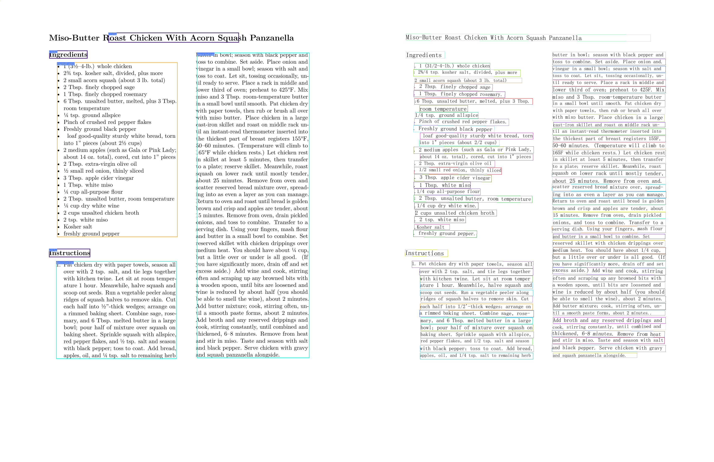

# Digitalization of Recipe Images Using Neural Networks

**Group "S-Train"**  
Dagani Federico, Galimberti Tommaso, Kodad Michal

---

## 📄 Project Overview

Our project aims to **digitize images of cooking recipes** taken from screenshots or scans of cooking websites and books. The main goal is to process these images and automatically extract and categorize their content into three raw text sections:

- **Dish Title**  
- **Ingredients List** 
- **Recipe Instructions** 

To train and evaluate our model, we used **digitized recipe databases** as ground truth. To simulate input images, we generated **synthetic data** by converting recipe text into Markdown pages (mimicking different cooking books and websites) and rendering them as images using Pandoc.

The model is composed of two main components:

1. **OCR Module** – detects bounding boxes and extracts raw text from the image  
2. **NLP Head** – classifies the extracted text into categories (title, ingredients, instructions)

## 🧾 Dataset

We used the **"Food Ingredients and Recipes Dataset with Images"** from Kaggle, which contains around **13,500 rows**. Each row includes the following string attributes:

- `Title`  
- `Ingredients`  
- `Instruction`  
- `Image_name`  
- `Cleaned_ingredients`

For our project, we focused on the first three fields: **Title**, **Ingredients**, and **Instruction**, as these align with the output targets of our model.

The only preprocessing step needed was to **remove rows with missing values** in any of the selected fields to ensure clean training data.

## 🧪 Methodology & Workflow

### 🔍 OCR: PP-StructureV2  

We used **PP-StructureV2** as our OCR engine, which follows a **layout-first strategy** rather than applying text recognition directly across the whole image.

1. **Layout Analysis**:  
   The model first analyzes the visual structure of the page using a **detection network**. It identifies and segments regions of interest — such as paragraphs, headings, tables, and other blocks — by drawing bounding boxes (bboxes) around them. These regions are semantically meaningful and correspond to logical sections of the page.

2. **Text Recognition**:  
   Once the blocks are detected, the system applies a **text recognition model** only within each identified bbox.

In our case, this approach allowed us to isolate text blocks likely corresponding to titles, ingredients, and instructions. These extracted texts were then passed to our NLP classifier for categorization.

### 🧠 NLP: Electra-small-discriminator  
The extracted text from each bbox was passed to an **Electra-small-discriminator** model, which classified the content into one of three classes:  
- **Title**  
- **Ingredients**  
- **Instructions**

---

### 🏗️ Initial Training & Issues  

### 🏋️ Model Training

To train the NLP classifier, we extracted tuples of `(title, ingredients, instructions)` from each row in the dataset. These three text segments were batched separately and tokenized using the Electra tokenizer. During each training step, we passed these tokenized batches one at a time through the model by calling it three times—once for each content type. At each step the losses are computed from the three different classes and summed togheter.

 The loss is then used to update the model's weights via backpropagation, using the AdamW optimizer. This training setup helped the model learn to distinguish between the three categories by explicitly presenting examples of each class during every training iteration.

Despite having a **balanced training set**, the model initially predicted only the class **"title"** for all inputs.  

The original rate of `1e-3` was too high, as the original model was trained with the maximum learnign rate of `5e-4`, so we actually destroyed the pretrained model. After lowering it to `1e-4`, the model started learning correctly.

With proper hyperparameters:
- **Loss Function:** Cross-entropy  
- **Optimizer:** AdamW  
- **Early stopping** on validation loss  

…the model quickly reached over **99% validation accuracy in 6 epochs**.

  
*Figure 1 – Accuracy curve over training epochs*

  
*Figure 2 – Loss curve over training epochs*

---

### 🚀 Deployment & Testing

On **synthetic images** (generated using our custom Markdown templates), the full pipeline (OCR + NLP) performed almost perfectly.

However, on **real-world images**, performance dropped significantly. The main issue was with the OCR, which often returned a **single large bbox** surrounding the entire image—failing to segment content correctly.

  
*Figure 3 – OCR output on a synthetic image: the model correctly detects multiple bounding boxes, each corresponding to a distinct section of the recipe layout.*

### 🔧 Fix Attempts

We tried several preprocessing steps to reduce visual noise in real-world images:
- Converting to grayscale  
- Cropping excess background  

…but these weren’t sufficient to overcome the bbox issue.

---

### 💡 Workaround Strategy

To address the OCR bottleneck, we experimented with:
- Using simple OCR only, without layout analysis, for images with 1 or 0 bboxes. 
- Retraining the NLP model using randomly truncated 10-token input windows, inspired by the idea behind dropout, to encourage better generalization and robustness to limited context.

This approach aims to help the system generalize better to real-world layout inconsistencies.

  

*Figure 5 – Modified OCR behavior: the system now returns multiple smaller bounding boxes instead of one large one.*

## 💬 Discussion

This project showed that our approach works well in controlled conditions. The NLP model, once properly tuned, was able to classify recipe sections accurately on synthetic images. The overall pipeline performed reliably when the input matched the training setup.

The main challenge emerged with real-world recipe images. The OCR model often struggled to correctly split the content, resulting in large bounding boxes that made classification difficult or impossible. When the Layout Information Extractor labeled the input as "image" or "figure", the OCR part of the network was never activated. This highlighted a gap between the synthetic training data and the more complex structure of real images.

To deal with this, we used only the OCR and retrained the NLP model with added synthetically shorter text segments, as the OCR would now return single lines. These changes helped improve performance a bit, but didn’t fully solve the problem.

We learned that even if individual components perform well, the full pipeline can still struggle when faced with noisy or unpredictable data. Improving the OCR or using more diverse training data could help make the system more robust in future versions.

---

## 📚 References

- **Dataset:**  
  [Food Ingredients and Recipe Dataset with Images (Kaggle)](https://www.kaggle.com/datasets/pes12017000148/food-ingredients-and-recipe-dataset-with-images)

- **OCR Model – PP-StructureV2:**  
  [PP-StructureV2: Turning Text Spotters into Layout and Table Parsers](https://arxiv.org/abs/2210.05391)

- **NLP Model – ELECTRA:**  
  [ELECTRA: Pre-training Text Encoders as Discriminators Rather Than Generators](https://openreview.net/pdf?id=r1xMH1BtvB)

